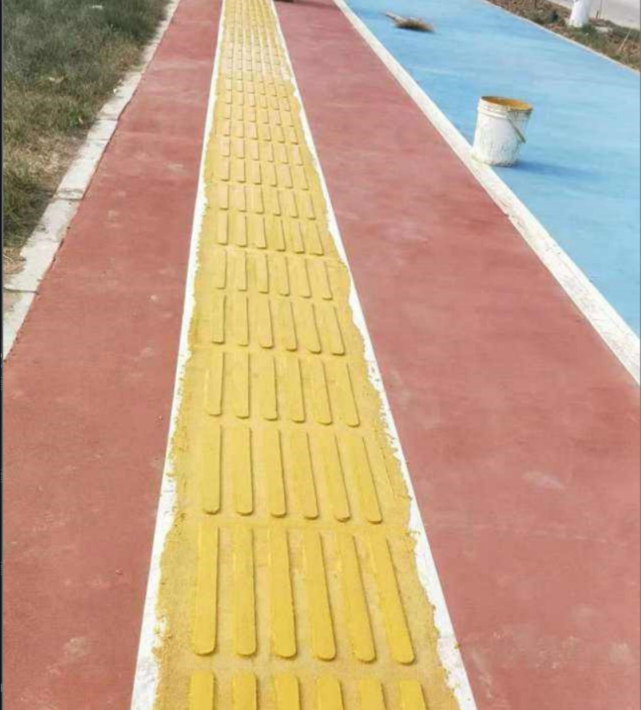
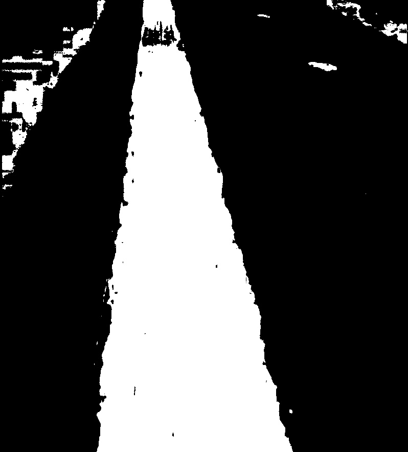
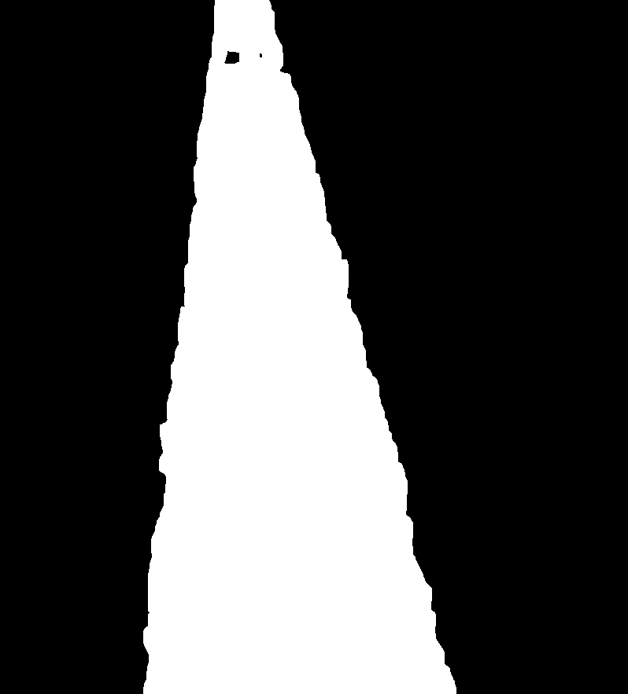

# Color-Segmentation-Based-Algorithm-for-Blind-Channel-Recognition
This is a blind alley recognition algorithm, based on color segmentation, written in Python code and the Opencv library

##  log
- 2024.4.5
  - Initial completion of color segmentation recognition algorithms and delineation

**原图：**

**划分后：**

- 2024.4.6
   - Completion of the general function, including recognition, filtering, labeling, screening
  
**原图：**

**划分后：**

**滤波后：**

**膨胀后**

**标记后：**

**筛选后：**
